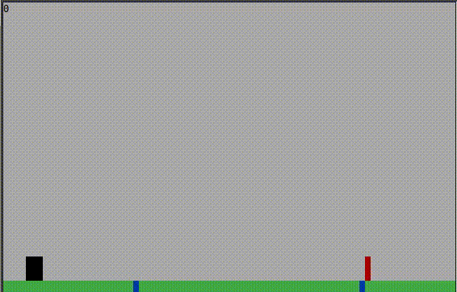

# dinorun
A game similar to chrome's dinosaur one, except this one runs inside a terminal.  
  


## Building
To build this, you need:

* dub
* dmd (other Dlang compilers might work, but this is the only tested one)

These bash commands will get you a binary of the game:  
```
dub fetch dinorun
dub build dinorun -b=release
```
This will create a binary named `dinorun` in the directory.  
To run it, do:  
`dub run dinorun`

---

## License
This project is licensed under the MIT License - see the `license.md` file included.  
It also uses [Adam D. Ruppe](https://github.com/adamdruppe)'s [terminal.d](https://github.com/adamdruppe/arsd/blob/master/terminal.d) which is licensed under the Boost License - see `source/arsd/LICENSE`